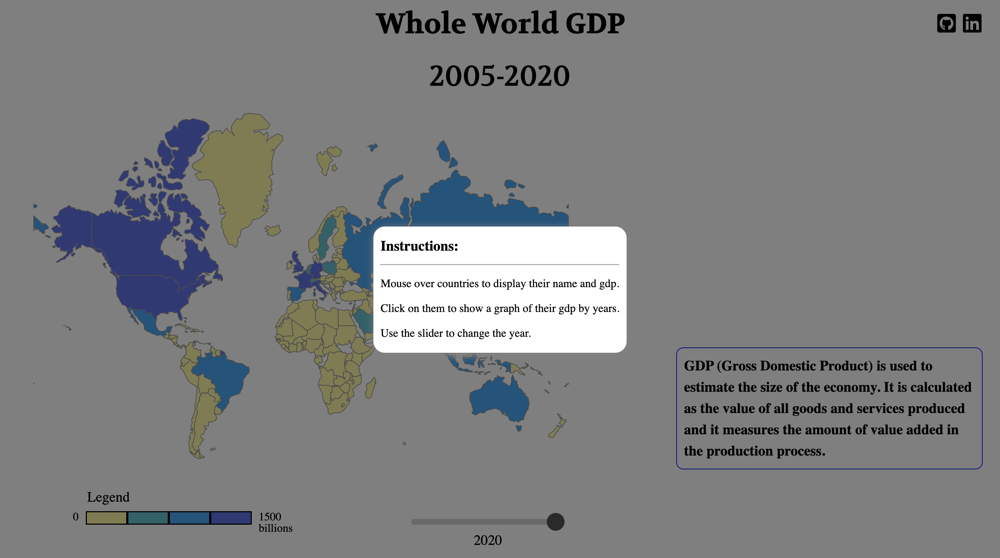
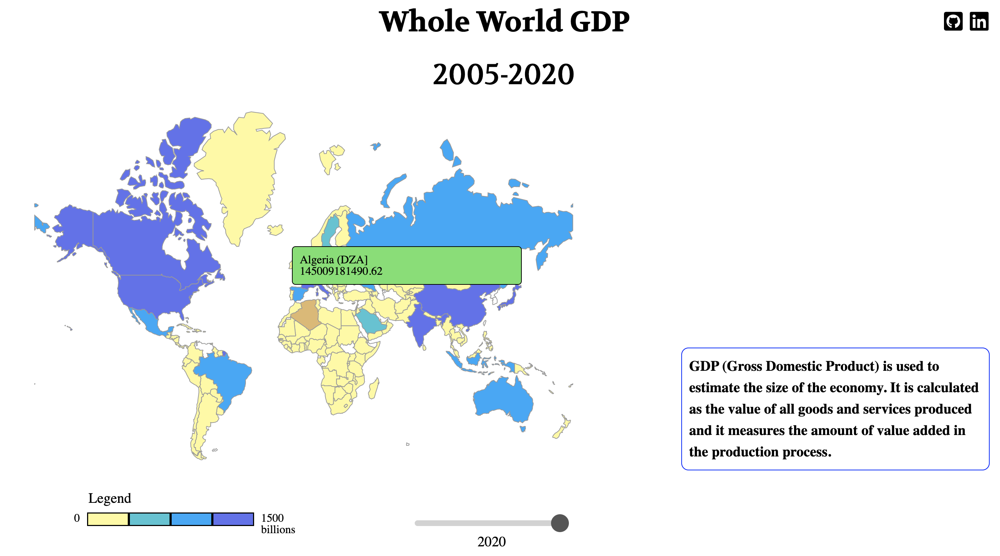
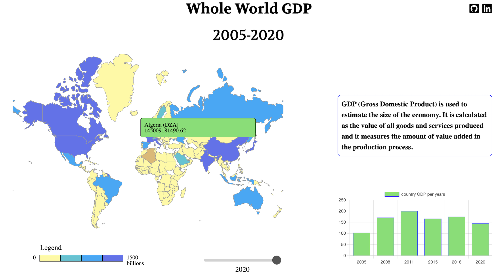

# Whole World GDP

<a href="https://zoumus.github.io/worldMapProject/">Live Site</a>

---

# Background: 

   Whole World GDP is a web application that displays a GDP by year for all countries.

---

# Technologies, Libraries, APIs:

   - javascript
   - D3.js
   - Chart.js
   - HTML5
   - CSS
   - Whole world geographic data obtained through https://cdn.jsdelivr.net/npm/world-atlas@2/countries-110m.json
   - Whole world GDP data obtained throught https://www.worldbank.org/en/about/annual-report/world-bank-group-downloads

---

# Features:

   - data visualization to render an interactive map by mouseover a country or a click
   - Interact with graphs, charts with a variety of :hover and :active events.
   - year slider animation where the user have access to switch the year
   - information pop up on click

---

# Project Interface:
   
   
   
   

---

# Future Features:
   - add more data to show
   - Allows data comparasion between different countries
   

   
